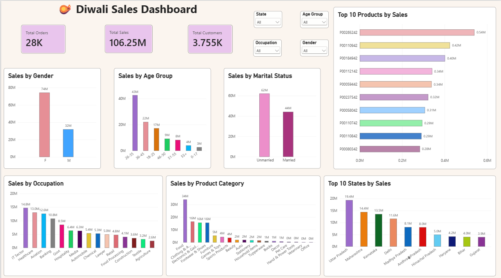
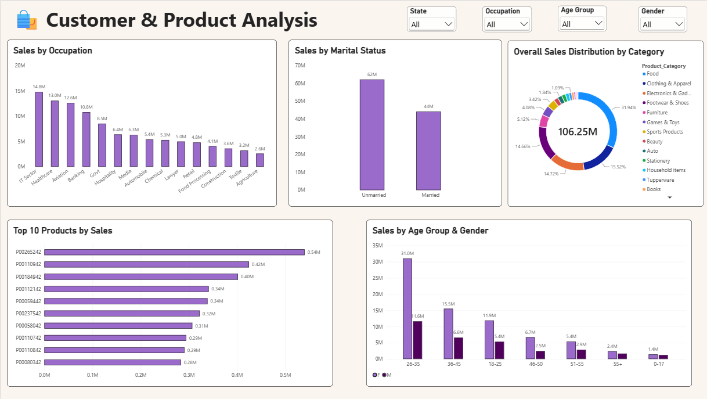

# 🪔 Diwali Sales Analysis

## 📌 Project Overview

This project analyzes Diwali sales data to understand customer
purchasing behavior, sales performance, product demand, and regional
trends.

The analysis was performed using **Python, Pandas, NumPy, Matplotlib,
and Seaborn**, followed by an interactive **Power BI dashboard** to
present key business insights.

## 🎯 Objectives

-   Analyze overall sales performance
-   Identify high-performing customer segments
-   Understand sales by gender and age group
-   Analyze sales across different states
-   Identify high-performing occupations
-   Analyze marital-status-based purchasing behavior
-   Identify top-performing product categories
-   Find the top-selling products
-   Build an interactive dashboard for business insights

## 🛠️ Technologies Used

Python · Pandas · NumPy · Matplotlib · Seaborn · Jupyter Notebook ·
Power BI

## 📊 Power BI Dashboard

### 🪔 Page 1 --- Diwali Sales Dashboard

-   Total Sales
-   Total Orders
-   Total Customers
-   Sales by Gender
-   Sales by Age Group
-   Sales by Marital Status
-   Sales by Occupation
-   Sales by Product Category
-   Top 10 States by Sales
-   Top 10 Products by Sales
### 📸 Dashboard Preview — Page 1



### 🛍️ Page 2 --- Customer & Product Analysis

-   Sales by Occupation
-   Sales by Marital Status
-   Overall Sales Distribution by Category
-   Top 10 Products by Sales
-   Sales by Age Group & Gender

### 📸 Dashboard Preview – Page 2

 

Interactive slicers are available for **State, Occupation, Age Group,
and Gender**.

## 💡 Key Insights

-   Female customers generated higher sales compared with male
    customers.
-   The 26--35 age group represents one of the strongest customer
    segments.
-   Uttar Pradesh, Maharashtra, and Karnataka are among the leading
    states in sales.
-   Married customers contribute significantly to overall sales.
-   IT, Healthcare, and Aviation are important occupation segments.
-   Food, Clothing & Apparel, and Electronics & Gadgets are among the
    major product categories.
-   A relatively small group of products contributes significantly to
    total sales.

## 📈 Business Recommendations

1.  Focus marketing campaigns on high-performing customer segments.
2.  Create region-specific promotions for high-sales states.
3.  Promote high-performing product categories during festive seasons.
4.  Target strong age and occupation segments with personalized offers.
5.  Use top-performing products in promotional campaigns and festive
    bundles.

## 📂 Project Structure

``` text
Diwali-Sales-Analysis/
├── Diwali_Sales_Analysis.ipynb
├── Diwali Sales Data.csv
├── Diwali_Sales_Dashboard.pbix
├── README.md
└── images/
    ├── dashboard_page1.png
    └── dashboard_page2.png
```

## 🚀 Conclusion

The analysis provides insights into customer behavior, product demand,
and regional sales performance during the Diwali season. Combining
Python-based exploratory analysis with an interactive Power BI dashboard
supports data-driven business decisions.
